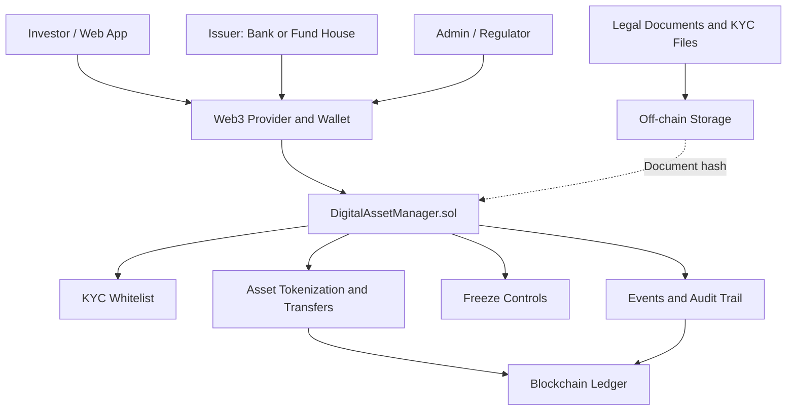

# Blockchain-Based Digital Asset Management

A smart-contract-based prototype for managing tokenized financial assets using blockchain. The project demonstrates KYC approval, asset issuance, controlled transfers, asset freezing, balance checks, and an event-based audit trail.

> **Project note:** This repository is an educational prototype. It is not production-ready financial infrastructure. The screenshots and default local contract address in the original report are illustrative/default Hardhat examples; replace them with evidence from your own run before submission.

## Problem Statement

Traditional financial asset management may involve disconnected ledgers, repeated reconciliation, slow settlement, intermediary costs, counterparty risk, and limited transparency. This project demonstrates how a shared blockchain ledger and smart-contract rules can improve traceability and automate selected controls.

## Proposed Solution

The `DigitalAssetManager` Solidity contract provides:
- KYC approval status for wallet addresses
- Registration/tokenization of assets with a unique ID
- Asset metadata and document-hash storage on-chain
- Unit balances for issuers and investors
- Transfers restricted to KYC-approved addresses
- Admin-controlled asset freezing
- Events for KYC changes, asset issuance, transfers, and freezing
- Balance lookup for an asset and wallet

Full legal documents and personal KYC files should remain off-chain. The contract stores a document hash rather than the full document.

## Architecture



## Transaction Flow

1. The administrator approves the issuer and investor using `setKYC`.
2. The issuer registers an asset with `issueAsset`, including its name, type, document hash, and total units.
3. The contract assigns the units to the issuer and emits `AssetIssued`.
4. The issuer transfers units to an approved investor using `transferAsset`.
5. The contract checks KYC status, asset validity, freeze status, and available balance.
6. Balances update and `AssetTransferred` is emitted when the transfer succeeds.
7. An administrator can freeze or unfreeze an asset using `freezeAsset`.
8. Auditors can inspect balances and transaction events.

## Smart Contract Functions

| Function | Purpose | Access |
|---|---|---|
| `setKYC(address user, bool status)` | Approve or revoke a wallet's KYC status | Admin only |
| `issueAsset(name, assetType, docHash, units)` | Create an asset and credit units to issuer | KYC-approved caller |
| `transferAsset(id, to, amount)` | Transfer asset units | KYC-approved sender and recipient |
| `freezeAsset(id, status)` | Freeze or unfreeze an asset | Admin only |
| `balanceOf(id, user)` | Read a wallet's balance | Public read |
| `kycApproved(user)` | Read KYC approval status | Public read |
| `assets(id)` | Read asset metadata | Public read |

## Technology Stack

- Solidity `^0.8.20`
- Hardhat
- Ethers.js
- Chai test assertions
- Local Hardhat network or Remix VM for demonstration

## Getting Started

### Prerequisites

Install a current supported version of Node.js and npm.

### 1. Create a Hardhat project

```bash
mkdir asset-chain
cd asset-chain
npm init -y
npm install --save-dev hardhat @nomicfoundation/hardhat-toolbox
npx hardhat init
```

Choose a JavaScript project when prompted.

### 2. Add the contract and scripts

Create the following files using the code in this repository/report:

```text
contracts/DigitalAssetManager.sol
scripts/deploy.js
test/DigitalAssetManager.test.js
```

### 3. Compile and test

```bash
npx hardhat compile
npx hardhat test
```

The report defines eight test scenarios. The expected result is 8/8 passing; run the tests locally and use your actual terminal output as proof.

### 4. Deploy to a local Hardhat network

Open terminal 1:

```bash
npx hardhat node
```

Open terminal 2:

```bash
npx hardhat run scripts/deploy.js --network localhost
```

Save the actual contract address and deployment transaction hash printed by your run. A default Hardhat address is not proof of a deployment on a public network.

### Alternative: Remix IDE

1. Open [Remix IDE](https://remix.ethereum.org/).
2. Create `DigitalAssetManager.sol` and paste the contract source.
3. Select a Solidity compiler compatible with `^0.8.20` and compile.
4. Deploy using Remix VM for a local demonstration.
5. Interact with the deployed contract functions.

## Test Scenarios

| Test | Expected behavior |
|---|---|
| Admin approves KYC | KYC status becomes `true` |
| Non-KYC user issues an asset | Reverts with `KYC not approved` |
| KYC issuer tokenizes an asset | Issuer receives the specified units |
| Valid transfer | Sender and recipient balances update |
| Transfer to non-KYC recipient | Reverts with `KYC not approved` |
| Transfer exceeds balance | Reverts with `Insufficient balance` |
| Transfer of frozen asset | Reverts with `Asset frozen` |
| Non-admin tries to freeze | Reverts with `Only admin` |

## Security and Limitations

- Do not store personal KYC information directly on a public blockchain.
- Admin privileges are powerful; production deployments need robust key management and access governance.
- Document hashes help detect changes to a document but do not prove that the document itself is legally valid.
- Public blockchain transactions may reveal metadata and require privacy analysis.
- Scalability, transaction fees, regulation, oracle reliability, and legacy-system integration need further evaluation.
- Audit the contract and run comprehensive tests before any real deployment.

## Repository Structure

```text
blockchain-digital-asset-management/
├── README.md
├── LICENSE
├── .gitignore
├── contracts/
│   └── DigitalAssetManager.sol
├── scripts/
│   └── deploy.js
├── test/
│   └── DigitalAssetManager.test.js
├── docs/
│   └── architecture.md
└── screenshots/
    └── README.md
```

## Demo

Add your recorded demonstration video to the repository's GitHub Releases, or upload it to YouTube/Google Drive and add the share link here:

`Demo video: Blockchain_Digital_Asset_Management_Web_Demo.mp4 `

Before submitting, replace illustrative screenshots with actual compilation, test, deployment, and contract-interaction screenshots. Do not publish private keys, seed phrases, `.env` files, or personal KYC documents.

## Author

**Ayishathul Hazeena S**

Academic project: Blockchain-Based Digital Asset Management in the Financial Sector.
